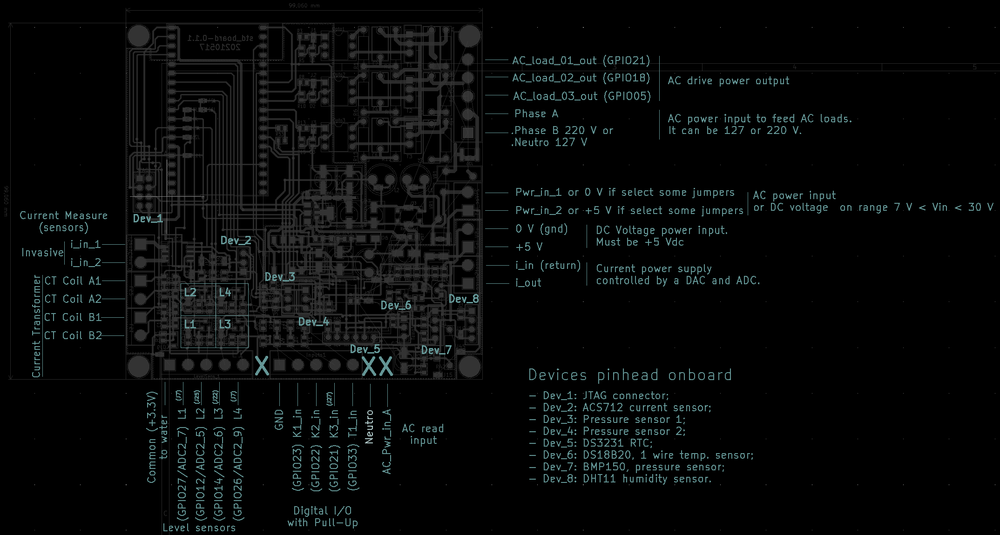

# std_board

std_board is an open hardware project that aims to bring the connectivity capacity of a microcontroller joining with sensors and actuators to a remote monitoring and control.

Renderized PCB with electrical components and modules are showed on the following picture.

## Content

* [About std_board](#about-std_board)
* [Features](#features)
* [Peripherals mapping](#peripherals-mapping)
* [Digital inputs](#digital-inputs)
* [Level sensor](#level-sensor)
* [Power input modes](#power_input_modes)
  + [Mode 1: 120-240 VAC input](#mode-1-120-240-vac-input)
  + [Mode 2: 24 VAC input](#mode-2-24-vac-input)
* [Current controller](#current-controller)

## About std_board

The main idea of std_board is help farmers to optimize production and monitoring some variables. Even this hardware is a little bit generic pplication that can control water pumps, valves, solenoids and any AC load. For this, it needs some feedback o real world physical variables like water weel level, time, water pressure inside pumps, ac voltage, ac current, thermal relay, and any digital input. The general purpose is optimize the production controlling the water flux.

The main concept of this system is interfaces one processor, e.g. ESP32, with electrical AC loads and physical parameters. 
 

## Features
This board has some that interfaces the ESP32 with real world variables.

* Five digital I/O;
* Input for pressure sensor;
* Input for temperature one wire temperature sensor (e.g. DS18B20);
* Umidity sensor DHT11;
* Current controller using internal DAC and onboard circuit processing;
* Protection circuit;
* AC voltage sensor;
* AC current sensor;
* AC load driver;
* JTAG connector - for debbugger (e.g. FT2232H);
* I2C connection for RTC module (e.g. DS3231);
* I2C connection for barometric sensor (e.g. BMP280);
* Four independent water level sensor circuits;
* Onboard LED indicator;
* Power supply with capability with different voltage levels input;

## Peripherals mapping

Pin map table of ESP32 onboard connections
.

The onboard system has the following connectivities:

## Digital inputs

## Level sensor

This board has four independent water level sensor circuit. Each circuit uses one BJT (bipolar junction transistor) and has one jump to exclude this transistor if desired. The main concept of this circuit a voltage division with amplification. The transistor has the function to amplifier the signal and transform it in a digital.

Some simulation has been done 

## Power input modes

### Mode 1: 120-240 VAC input
This mode 
to 12VDC and 120 mA;
### Mode 2: 24 VAC to 5 VDC;

## Current controller

## AC Voltage sensor

## AC current sensor

### SoC

### Faraday law 

# Example application

This example uses L1 and L4 circuit water level sensor.

L1: put jump J22 closed;
L4: put jump J7 closed;

# Assembly of some boards;

## Board N

